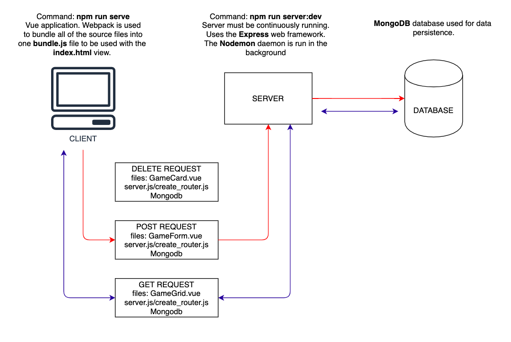

# Homework: Full Stack Games Hub App

### Questions

1. What is responsible for defining the routes of the `games` resource?

**The `server.js` Express server and its associated `create_router.js` Router.**

2. What do you notice about the folder structure?  What's the client responsible for? Whats the server responsible for?

**The `client` is responsible for the front-end Vue application, and the `server` for the back-end `Express` framework and `MongoDB` database.**

3. What are the the responsibilities of server.js?

**It sets up a connection between the front-end app and back-end database using the `MongoClient` instance. It defines the `RESTful` routes for the front-end app and makes sure the server connection is up and running through the `app.listen()` method.**

4. What are the responsibilities of the `gamesRouter`?

**It allows the Express `server.js` server to remain manageable by creating a generic template to generate `RESTful` routes. It is initialised with the collection `gamesCollection` from the database, and used to help manage the `/api/games` root path.**

5. What process does the the client (front-end) use to communicate with the server?

**It uses the `getGames()`, `postGame()` and `deleteGame()` methods in `GamesService.js` to generate HTTP requests between the front-end and server.**

6. What optional second argument does the `fetch` method take? And what is it used for in this application? Hint: See [Using Fetch](https://developer.mozilla.org/en-US/docs/Web/API/Fetch_API/Using_Fetch) on the MDN docs. 

**It takes an optional `init` argument, which is an object containing any additional settings that may need to be attached to the request, such as the `body` to send alongside the HTTP request, or additional `headers`, or specifying the `method`, such as POST/GET.**

7. Which of the games API routes does the front-end application consume (i.e. make requests to)?

**It seems to use `GET`, `POST` and `DELETE`, located in the `GamesService.js` file.**

8. What are we using the [MongoDB Driver](http://mongodb.github.io/node-mongodb-native/) for?

**To set up a connection between the server and the database using the `MongoClient` instance, ultimately passing information back and forth between the database back-end and app front-end.**

## Extension

Why do we need to use [`ObjectId`](https://mongodb.github.io/node-mongodb-native/api-bson-generated/objectid.html) from the MongoDB driver?
**If we need to query the database for a `document`, we need to be able to do so with the `_id` of the `document`. An `_id` is instance is created using the `ObjectID` constructor.**

